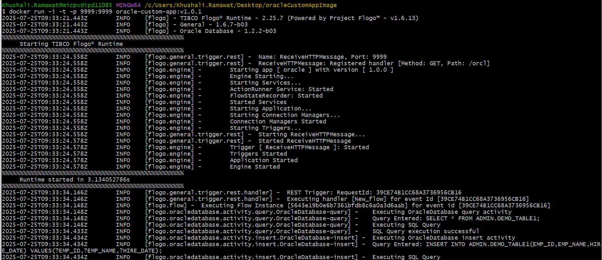
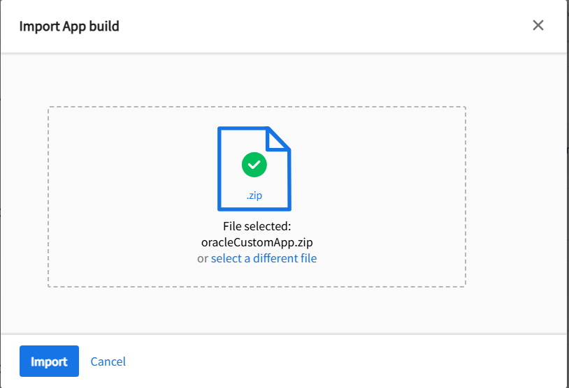
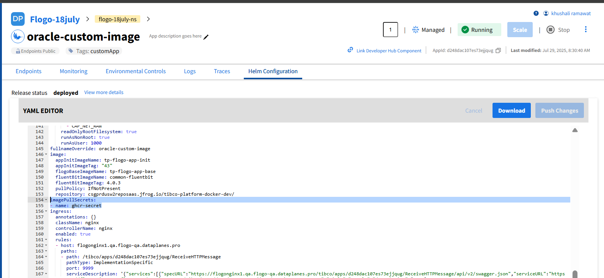

# Deploy and Run Custom App Image for Flogo Oracle DB Application on Tibco Platfrom.


## Description

This example demonstrates how you can build Flogo applications with all dependencies preinstalled outside TIBCO Platform by using
custom Docker images.
This approach provides the capability to:
* Deploy applications directly to TIBCO Platform without requiring Internet access to Flogo provisioner.
* Eliminate the need to provisioning Flogo Connectors and supplements separately in your Data Plane.
* Create lightweight application images based on Alpine or Debian, instead of using the default Amazon Linux image.

You can create Docker images that include all required application dependencies, build your application, and import the build.zip file to TIBCO Platform.

Flogo Oracle DB app need runtime oracle client libraries to run app. In the attached Docker file, we are installing the runtime dependencies for Flogo oracle DB app. 

The main purpose of this sample is:
* To deploy your own custom application image with all dependencies preinstalled directly on TIBCO Platfrom.


## Prerequisites

1. Ensure that docker is up and running. Here will be using Docker for creating application image.
2. In order to create Dokcer image locally make sure Docker file, start.sh file and Flogo Oracle DB app linux binary should be present at same location.
3. Create a context by using TIBCO Flogo® Extension for Visual Studio Code version 1.3.2 or higher.

## Build a Docker image with all required dependencies

1. Create a folder and place your Flogo Oracle DB app linux binary, Docker file and start.sh file in it. And open terminal from this location.

2. Build Flogo Oracle DB app image using below command:
    
    `docker build -t  oracle-custom-app:v1.0.1 .`

    Here docker reads the Dockerfile to create an image and tags it with the name oracle-custom-app:v1.0.1.
    
    > **Note:** There is a dot (.) at the end of the command that represents the current directory, which contains the Dockerfile and other files used during the build.

    

4. Check for oracle-custom-app image is created or not using below command:
    
    `docker images`

    

5. Run oracle-custom-app docker image using below command:
    
    `docker run -i -t -p 9999:9999 oracle-custom-app:v1.0.1`

    Here above command maps port 9999 on the host machine to port 9999 within the oracle-custom-app container. It is needed because the application endpoint is exposed on port 9999.

    

6. Hit below curl command to get output: 
    
    `curl http://localhost:9999/orcl`

    Here above command sends an HTTP request to your local machine (localhost) on port 9999, requesting the /orcl endpoint.

    
  

## Push the application image to your registry, such as Docker Hub or a private registry

    Here we are pushing docker image to GitHub Conatiner Registry (GHCR).

1. Log in Docker using the GitHub PAT token.

    `echo YOUR_PAT_TOKEN | docker login ghcr.io -u YOUR_GITHUB_USERNAME --password-stdin`

    Make sure the token should have scope like write:packages,read:packages, repo to push the image.

    


2. Tag and push your Docker image::
  
    `docker tag your-image ghcr.io/YOUR_GITHUB_USERNAME/your-repo:tag`
    `docker push ghcr.io/YOUR_GITHUB_USERNAME/your-repo:tag`
    
      > **eg:** docker tag oracle-custom-app:v1.0.1 ghcr.io/kramawat-tibco/oracle-custom-app:v1.0.1
      > **eg:** docker push ghcr.io/kramawat-tibco/oracle-custom-app:v1.0.1

    Make sure that the private repo 'oracle-custom-app' is created on github 

    
    

3. Obtain the fully qualified image name from your image registry. 
      > **eg:** ghcr.io/kramawat-tibco/oracle-custom-app:v1.0.1

4. Create a Docker registry secret for GHCR.

    `kubectl create secret docker-registry ghcr-secret \`
    `--docker-server=ghcr.io \`
    `--docker-username=YOUR_GITHUB_USERNAME \`
    `--docker-password=YOUR_GHCR_PAT \`
    `--docker-email=YOUR_EMAIL@example.com`

     > **Note:** Public container images from GHCR can be accessed without authentication, but private images require a Personal Access Token (PAT) for access. To pull private images, Kubernetes needs valid credentials to authenticate with GHCR. By including the created secret in the imagePullSecrets section of your pod or deployment YAML, you allow Kubernetes to securely and automatically retrieve the image during deployment.

## Build application with FQImage 

1. Create a context by specifying the appropriate flags using TIBCO Flogo® - App Build Command Line Interface and TIBCO Flogo® Extension for Visual Studio Code version 1.3.2 or higher.

      > **eg:** flogobuild create-context -n "<context-name>" -v "<path-to-.vsix file>" --set-default

      

2. After creating the context, create the TIBCO Platform deployment zip file for your Flogo application using Flogo® - App Build Command Line Interface (CLI).

      > **eg:** flogobuild build-tp-deployment -f "<path-to-flogo-app-file>" -i "<fullyqualified-custom-container-image-name>" -c "<context-name>" -t "<tag1, tag2>" -o "<path-for-zip-file>" -z "<zip-file-name>"

    

## Import, Deploy build.zip and Run the Application on TIBCO Platfrom

1. Import the generated build.zip file to TIBCO Platform. Deploy your custom app image build using either the Flogo provisioner or Helm chart.

      
      
      
      Here don't need to provision Flogo build, Oracle Database connector and upload supplement.

2. Specify imagePullSecret for custom app image build deployed using Helm manage way.

      

    Here we are using private image hence need to specify imagePullSecret value in deployment YAML.

3. Start application, set endpoint visibility to public and hit the endpoint to get logs.

      


## Understanding Dockerfile and start.sh file configuration

### Understanding Dokcerfile

In the Dockerfile,
1. Base Image:
    
    ```dockerfile
    FROM alpine:3.19
    ```

    Uses Alpine Linux 3.19 as the base image. It's lightweight and secure, ideal for small containerized applications.

2. Image Metadata:

    ```dockerfile
    LABEL maintainer="Cloud Software Group, Inc."
    ```

    Specifies the maintainer of the Docker image. Useful for documentation and support.

3. Set Environment Variables:
  
    ```dockerfile
    ENV LANG=C.UTF-8 \
        LC_ALL=C.UTF-8 \
        LD_LIBRARY_PATH=/opt/oracle/instantclient_21_13 \
        PATH=/opt/oracle/instantclient_21_13:$PATH
    ```

    LANG and LC_ALL: Set the locale to UTF-8 for consistent character encoding.
    LD_LIBRARY_PATH: Sets the dynamic linker path to locate Oracle Instant Client libraries.
    PATH: Adds Oracle Instant Client directory to system PATH for command accessibility.

4. Install Packages & Create Directories:
    
    ```dockerfile
    RUN apk add --no-cache apache2-utils bash ca-certificates curl gcompat libaio libnsl libstdc++ shadow unzip && \
        mkdir -p /opt/oracle /home/flogo /app/logs /usr/tp/flogo && \
        groupadd -g 1000 flogo && \
        useradd -u 1000 -g 1000 -s /bin/sh -M flogo
    ```

    Installs required packages (like bash, curl, unzip, Oracle dependencies).
    --no-cache prevents saving package index to reduce image size.
    Creates directories needed by the application and Oracle client.
    Adds a new group and user (flogo) with fixed UID/GID (1000) for consistent permissions.

5. Set Working Directory for Oracle Client:  
    
    ```dockerfile
    WORKDIR /opt/oracle
    ```

    Changes the working directory to /opt/oracle where Oracle Instant Client will be installed.


6. Download & Extract Oracle Instant Client:
  
    ```dockerfile
    RUN curl -O https://download.oracle.com/otn_software/linux/instantclient/2113000/instantclient-basic-linux.x64-21.13.0.0.0dbru.zip && \
        unzip instantclient-basic-linux.x64-21.13.0.0.0dbru.zip && \
        rm instantclient-basic-linux.x64-21.13.0.0.0dbru.zip
    ```

    Downloads the Oracle Instant Client ZIP file. Unzips the archive. Removes the ZIP to reduce image size.

7. Set Application Directory & Copy Files:
    
    ```dockerfile
    WORKDIR /usr/tp/flogo
    COPY start.sh flogo-oracle ./
    ```

    Sets working directory for your app. Copies the start script and app binary (flogo-oracle) into the image.

8. Set Permissions:
    
    ```dockerfile
    RUN chown -R flogo:flogo /opt/oracle /home/flogo /app/logs /usr/tp/flogo && \
        chmod +x start.sh flogo-oracle
    ```

    Gives ownership of all relevant folders to the flogo user. Makes the script and binary executable.

9. Switch to Non-Root User and Define Entrypoint:
    
    ```dockerfile
    USER flogo
    ENTRYPOINT ["./start.sh"]
    ```

    Runs the application as the non-root user flogo for better security practices. Defines the command to run when the container starts — the start.sh script, which likely starts the application.
 

### Understanding start.sh file

1. Shebang:
    
    ```sh
    #!/usr/bin/env bash
    ```
  
    Specifies the script should run using the Bash shell, located via the environment (env). Ensures compatibility across different systems.

2. Create Log Directory:
    
    ```sh
    mkdir -p /app/logs/${HOSTNAME}/flogoapp
    ```
    
    * Creates a directory structure for logs. 
    * Uses the environment variable HOSTNAME to create a unique subdirectory for the current container or host.
    * The -p flag ensures parent directories are created if they don't exist, and avoids errors if the directory already exists.


3. Set Default Environment Variable:
    
    ```sh
    export FLOGO_FILES_ROOT_DIR="${FLOGO_FILES_ROOT_DIR:-/tmp/flogo}"
    ```

  * Sets the environment variable FLOGO_FILES_ROOT_DIR if not already set.
  * Uses /tmp/flogo as the default directory for Flogo files.
  * Allows users to override this by setting FLOGO_FILES_ROOT_DIR before running the script.

4. Start Application and Manage Logs:

    ```sh
    ./flogo-oracle 2>&1 | tee >(rotatelogs -t /app/logs/${HOSTNAME}/flogoapp/otel.log 10M)
    ```

  * Runs the flogo-oracle binary located in the current directory.
  * Redirects both stdout and stderr (2>&1) so all output is captured.
  * Pipes the output to tee, which splits it:
    * One copy goes to the console (standard output).
    * The other copy is sent to rotatelogs.
  * rotatelogs manages the logs by rotating them when they reach 10MB (10M), keeping log files manageable and organized.
  * Logs are saved under /app/logs/${HOSTNAME}/flogoapp/otel.log, matching the directory created earlier.


## Outputs

Custom App Image run for Oracle Database


## Troubleshooting

* If you see error like: `Cannot locate a 64-bit Oracle Client library: "libclntsh.so: cannot open shared object file: No such file or directory"` then make sure that your docker file installed oracle client libraries successfully
* If you see application in Failure state and ImagePullBackOff error in app pod like: `Failed to pull image "ghcr.io/kramawat- ││ tibco/oracle-custom-app:v1.0.1": failed to pull and unpack image "ghcr.io/kramawat-tibco/oracle-custom-app:v1.0.1": fail ││ ed to resolve reference "ghcr.io/kramawat-tibco/oracle-custom-app:v1.0.1": failed to authorize: failed to fetch anonymou ││ s token: unexpected status from GET request to https://ghcr.io/token?scope=repository%3Akramawat-tibco%2Foracle-custom-a ││ pp%3Apull&service=ghcr.io: 401 Unauthorized` then make sure that you have specified the imagePullSecret and the created secret should be present in same namespace where the app is deployed.
* If you see error like: `Failed to import build with error: failed to retrieve buildtypes catalog json: stat /data/d24a8ji3ndns73da7pf0/tibco/flogo/base/catalog.json: no such file or directory` then make sure you have provisioned Flogo build.


## Contributing
If you want to build your own activities for Flogo please read the docs here.

If you want to showcase your project, check out [tci-awesome]

You can also send an email to `tci@tibco.com`

## Feedback
If you have feedback, don't hesitate to talk to us!

* Submit feature requests on our [TCI Ideas](https://ideas.tibco.com/?project=TCI) or [FE Ideas](https://ideas.tibco.com/?project=FE) portal
* Ask questions on the [TIBCO Community](https://community.tibco.com/answers/product/344006)
* Send us a note at `tci@tibco.com`

## Help
Please visit our [TIBCO Cloud<sup>&trade;</sup> Integration documentation](https://integration.cloud.tibco.com/docs/) and TIBCO Flogo® Enterprise documentation on [docs.tibco.com](https://docs.tibco.com/) for additional information.

## License
This TCI Flogo SDK and Samples project is licensed under a BSD-type license. See [license.txt](license.txt).

