# PostgreSQL Database CRUD Example

## Description

This example demonstrate how we can create and use PostgreSQL CRUD activities.
PostgreSQL CRUD app bascially contains 4 activities. The main purpose of these activities are to insert data, update the data, delete the data and then finally perform query to fetch data from PostgreSQL database.

## Prerequisites

1. Ensure that the PostgreSQL driver is installed on your machine. If it is not installed, please refer to the steps in the Install Connectors Driver section.
2. Ensure that you have administrative privileges, as they are required to install the connector drivers. 
3. Ensure that PostgreSQL Database server must be up and running either on local computer or on AWS EC2 instance.
4. You need to make sure that your public ip is whitelisted (If you are using database hosted on AWS EC2 instance).

## Install Connectors Driver

1. In Visual Studio code, click on Flogo icon on left side menu bar > Install Prerequisites for Flogo Connectors option and select PostgreSQL connector from the list and click on OK button to install the PostgreSQL database drivers.
2. The script will install ODBC Driver Manager and PostgreSQL Connector Driver.

 
  

## Import sample into VSCode Workspace

1. Download the sample flogo file i.e., postgresql-ssl.flogo
2. Place the downloaded file into your Visual Studio Code workspace.
3. Open the file by clicking on it in VSCode.

## Understanding the configuration

### The Connection

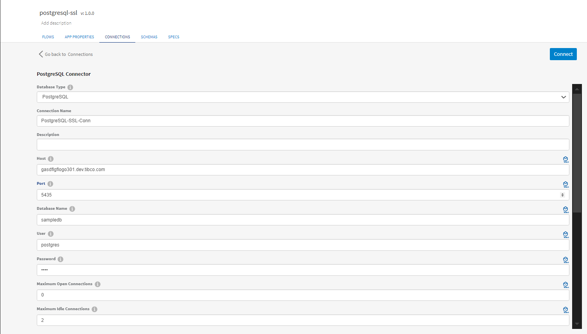

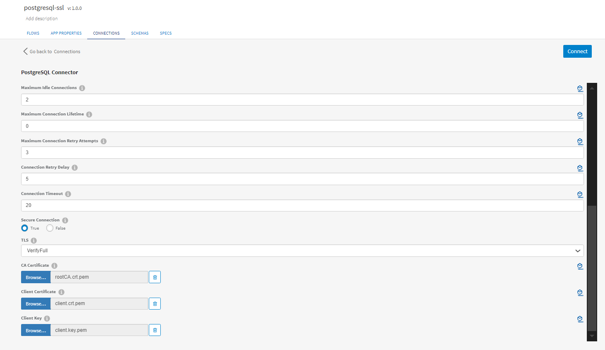

In the connection, note that:

1.  Host - In this field we give public ip/public DNS of EC2 instance on which database is hosted or the ip of VM where the PostgreSQL database is hosted in    
tibco premies.
2.  Port - Port on which server is running. 
3.  Database Name - Name of the databases to which we are connecting.
4.  User - Username to connect to PostgreSQL Database.
5.  Password - Password to connect to PostgreSQL Database.
6.  Maximum Open Connections - Number of total open connections to the databases. Default is 0 which means there is no maximum limit.
7.  Maximum Ideal Connections - Number of idle connections in the connection pool. Default is 2. If value <= 0 means no idle connections are retained
8.  Maximum Connection Lifetime - Maximum amount of time a connection may be reused. Valid time units are ns, us (or µs), ms, s, m, h. Example: 60s, 60m or 6h45m. Default value is 0 which means connection will be used forever.
9.  Maximum Connection Retry Attempts - Maximum number of attempts to reconnect with a database server. Default value is 3
10. Connection Retry Delay - Number of seconds to wait between connection retry attempts. Default is 5 sec.
11. Connection Timeout - Timeout (in sec) for establishing connection. Set it to 0 for no timeout
12. Secure Connection - Establishes the secure connection when set to True.
13. TLS - Type of authentication to use. Different TLS Methods are VerifyCA, VerifyFull
14. If Secure Connection is set to true then pass CA Certificate, Client Certificate and Client key to ensure the server is trusted and secure.
 

### The Flow

* If you go inside the app, you can see in flow we have 4 activities (Insert, Update, Delete and Query) that perform some operations. Also in flow we have Log Message to log the output and Return activity for getting the output.
* The auto-complete feature is available for CRUD operations (PostgreSQL Query, Insert, Update, and Delete). During design time, users can search for table names and available columns using this feature. To enable auto-complete, the schema name must be specified in the settings tab of the CRUD activities.

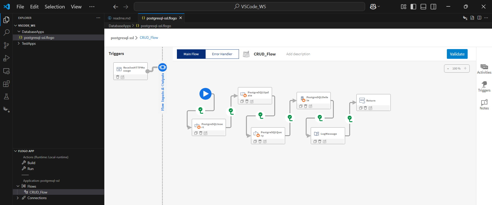

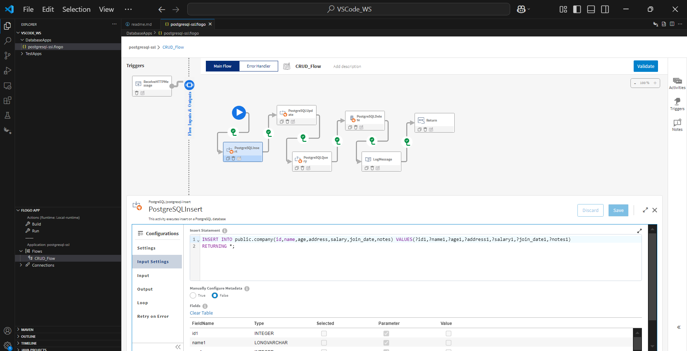

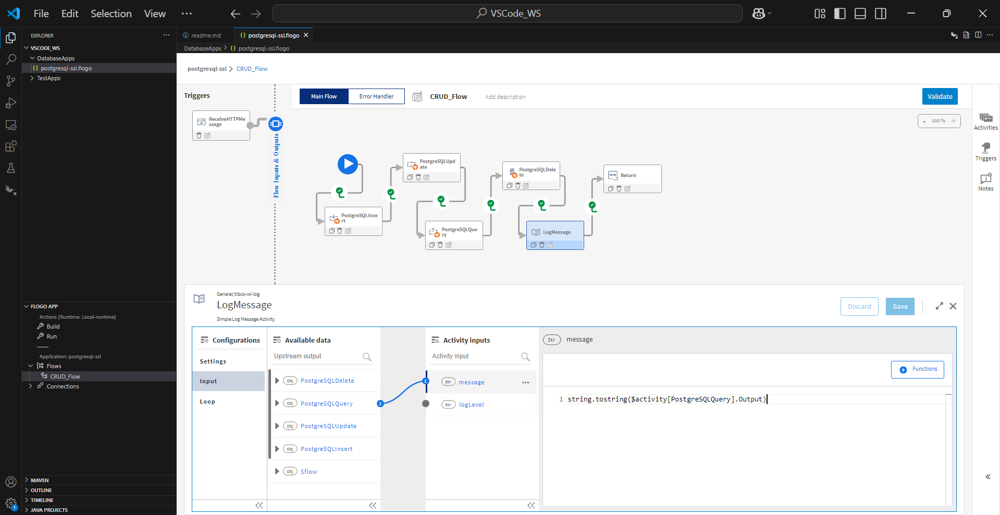

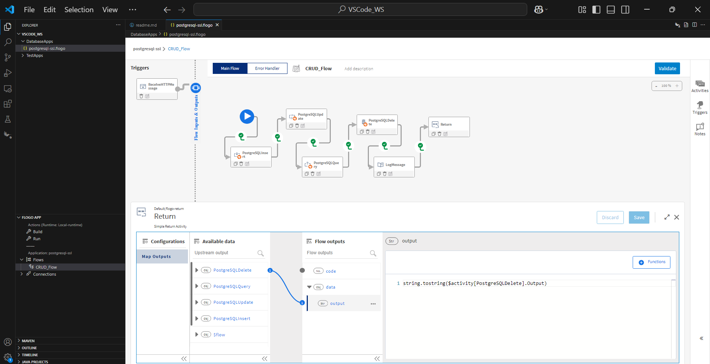

### Run the application

For running the application, 
1. Start by adding a local runtime in Visual Studio Code. Assign a name to the runtime and click the "Save" button.

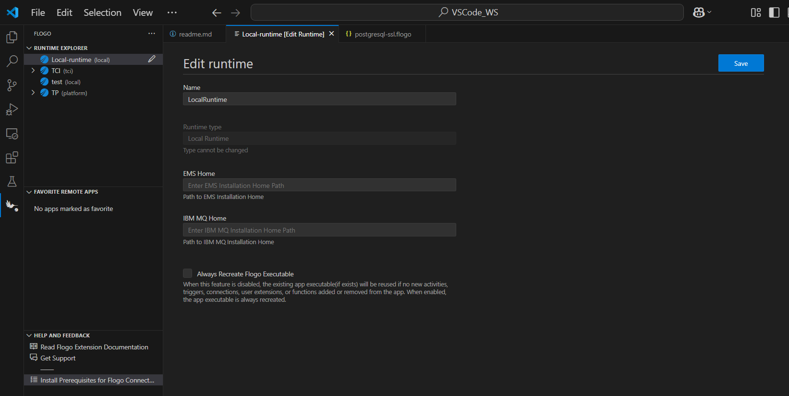

2. Select the local runtime you added for your Flogo PostgreSQL app. To do this, click on the FLOGO APP in the explorer, then click "Actions" and select the added Local Runtime.

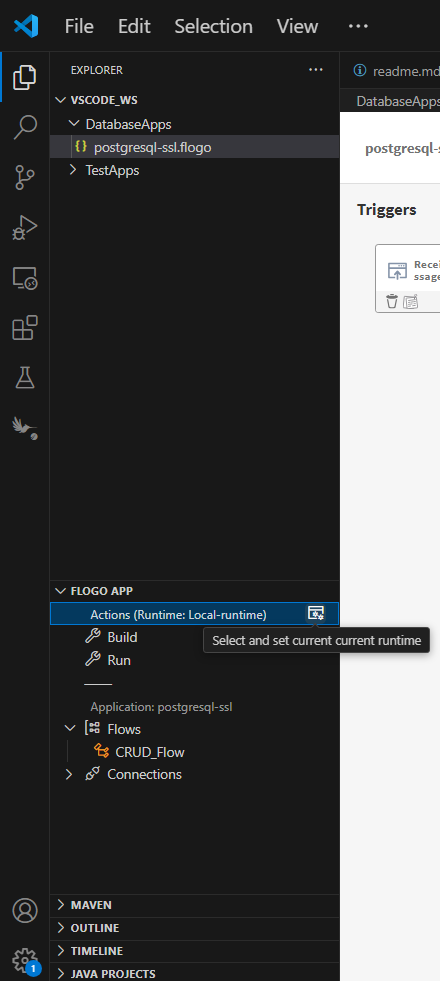

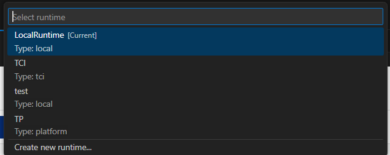

3. Now Build your Flogo PostgreSQL app. In the FLOGO APP section, click on "Build," then click on "Configure and Run Action." 
Select your desired OS and Architecture, and finally, click "Run."

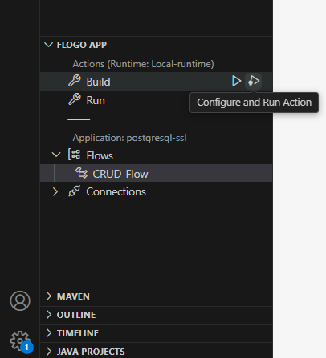

4. Once build is successfull you can see the binary in bin folder.

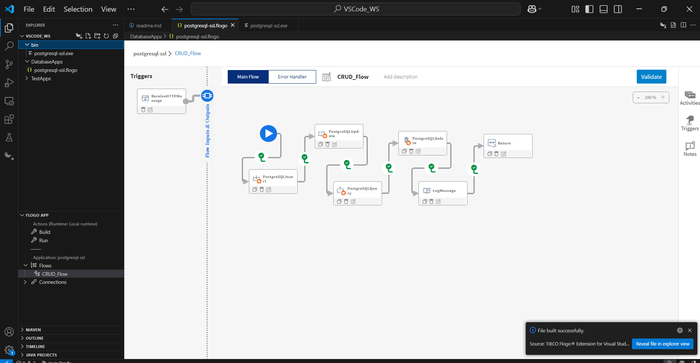

5. Now Run the PostgreSQL app. 

6. After running app hit the endpoint and see the results.

7. After endpoint hit you will able to see the logs in VS code terminal.

## Outputs

1. Verify output by hiting the endpoint

2. Verify output in VS code terminal

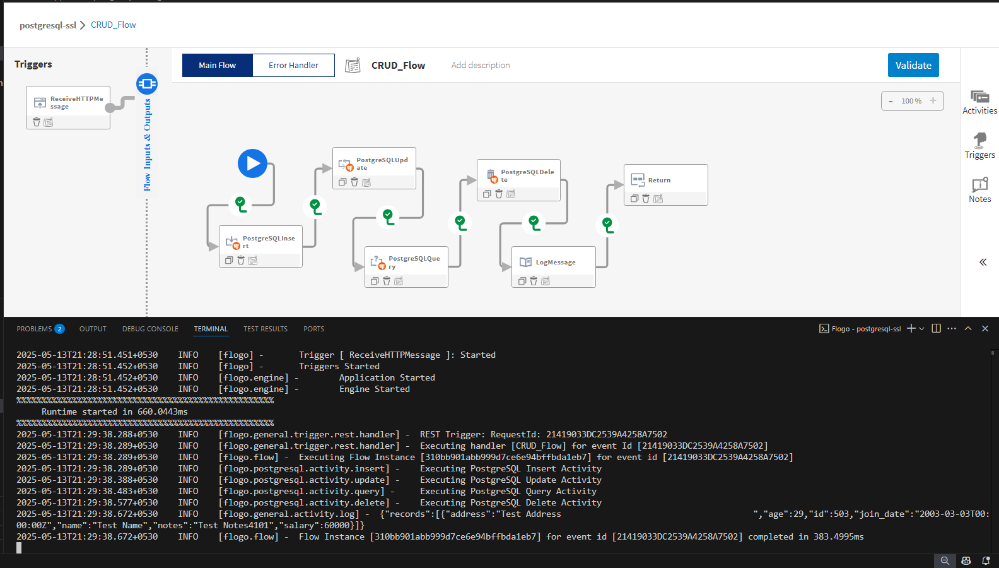

## Troubleshooting

* If PostgreSQL database is not up and running then we should see error `Connection timed out` while creating connection.
* If you see error like: `test connection failed: formatting connection string failed, driver name not found, check whether any postgres driver is installed` then make sure to first install PostgreSQL drivers using install Prerequisites for Flogo Connectors.
* If you are not able to fech the tables or table coloumns while typing a query, then make sure your connection should be establish successfully and you have entered the Schema name in activity setting tab.

## Help

Please visit our [TIBCO Flogo&trade; Extension for Visual Studio Code documentation](https://docs.tibco.com/products/tibco-flogo-extension-for-visual-studio-code-latest) for additional information.