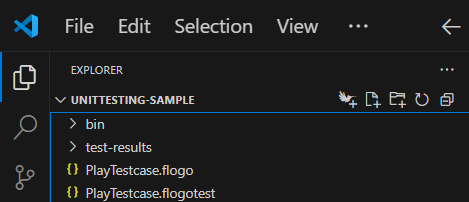
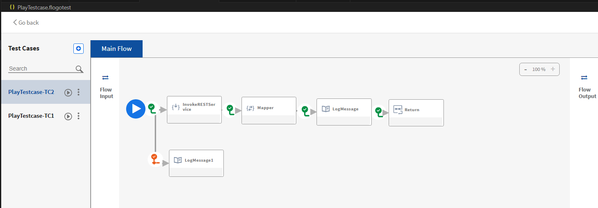
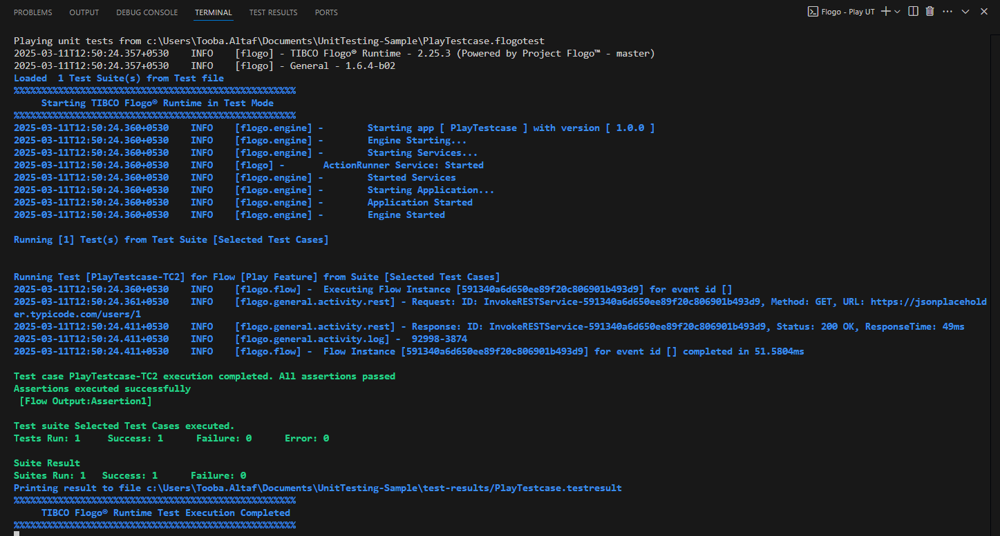
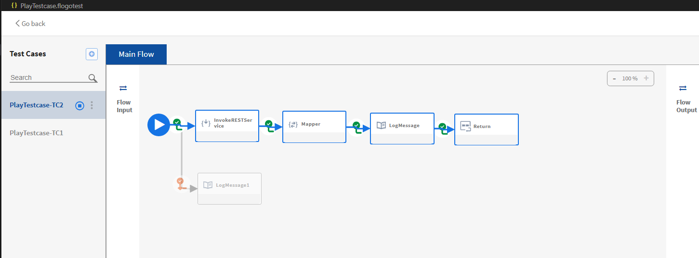
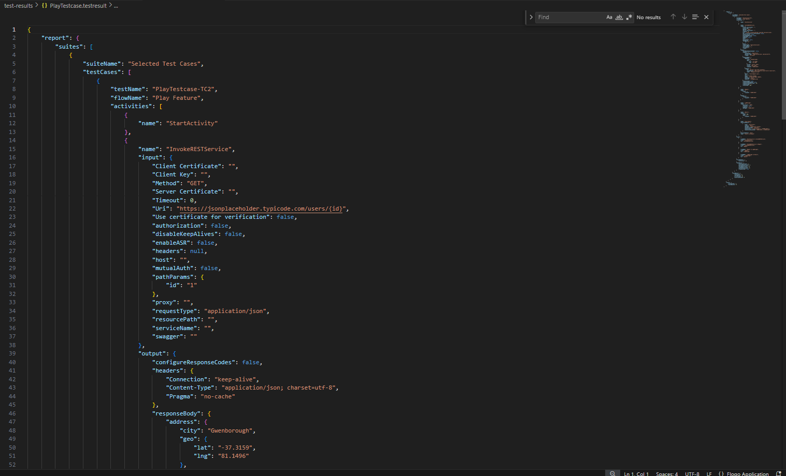
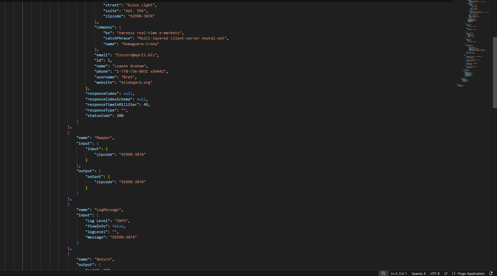
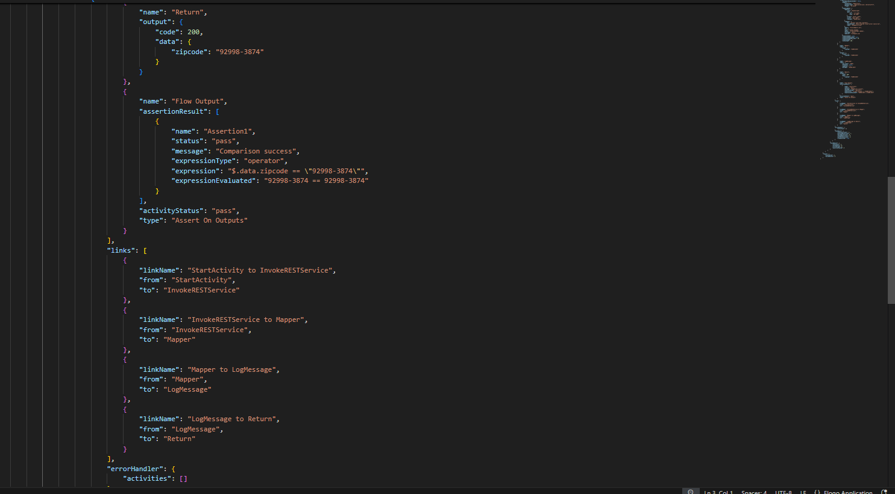
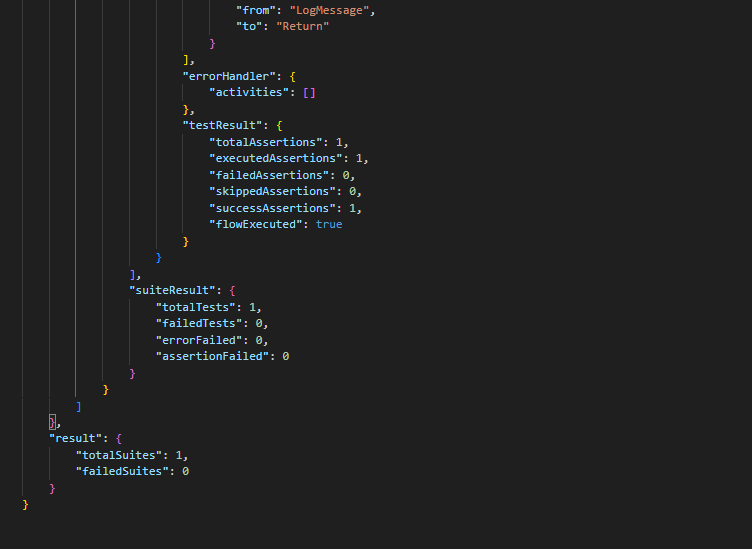
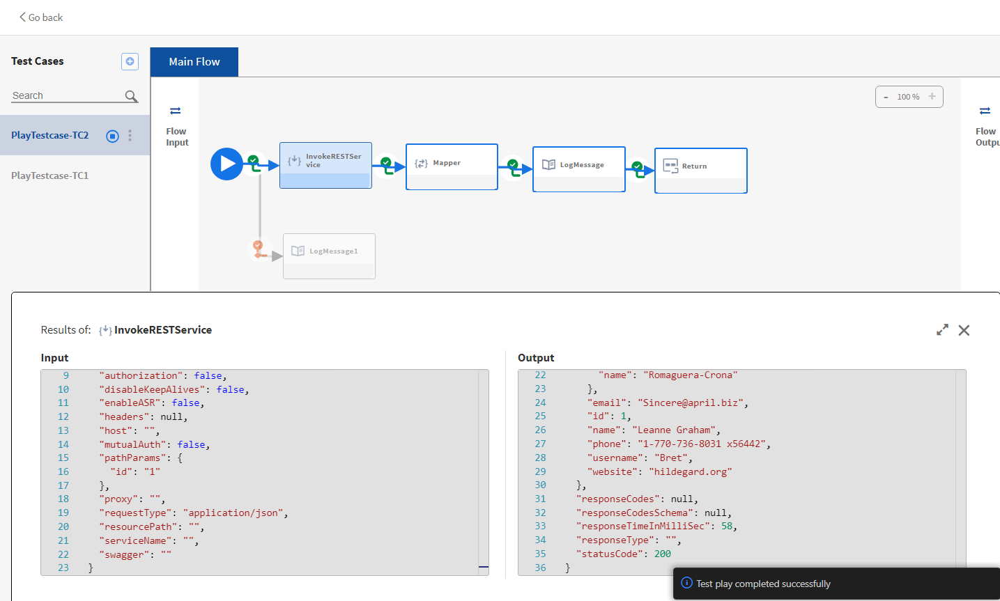

# Unit Testing - Playing a Test Case Once

## Description

With Unit Testing, you can monitor the health of your application and detect errors in individual flows or activity levels. After you design a flow, you can test it by playing it once.You provide the input to the flow in playing a test case once. It executes the flow on demand without using a trigger. Each activity executes independently and displays its logs. It can help detect errors in the flow upfront without actually building the app. The play feature in VSCode plays the same role as the flow tester in TCI.

## Prerequisites

* You need go version=go1.20.12 or above, to be installed on your machine. For information about go installation on Windows, Mac, or Linux, see https://go.dev/doc/install" as a pre-req before running app locally.

## Import the sample

1. Download the PlayTestcase.flogo and PlayTestcase.flogotest file.

2. Put these files in VSCode workspace.

### Procedure to run the application

1. Click on the PlayTestcase.flogotest file.

2. Once you click on the flow inside the .flogotest file , the testcases created will show up.

3. To run a test case, click on the Play Testcase icon in the .flogotest file.

4. View the execution logs of the flow in the terminal. The execution path is highlighted in blue and other activities appear grayed out. You see a new or updated test results file with additional input, output, or error data captured during activity execution.
 

5. Click the executed tasks to see the inputs, outputs, or errors of the activity in read-only mode. If an activity is executed and does not have any configuration or output, you cannot click it after execution.

## Notes & Conclusion

1. It can be cumbersome to test flows that start with a trigger as the triggers activate based on an external event. So, before you can test the flow, you must configure the external app to send a message to the trigger to activate it and consequently execute the flow.

2. The play a test case once feature eliminates the need to activate the trigger to execute the flow.

3. It can help detect errors in the flow upfront without actually building the app.

4. You must stop the testing mode to configure the test case.

5. When a test is running, the Play Testcase icon changes to the Stop Testcase icon. You must stop an ongoing test case to run a different one.

6. The play feature in VSCode is as same as that of flow tester in TCI.

