# AzureServiceBus Sample

## Description

This example demonstrates how to publish different types of messages to Azure Service Bus queues and topics, and how to receive and log messages using queue and topic subscribers.

The flow in the AzureServicebusSample app basically publish different types of messages over a queue and topic entities.The AzureServiceBus Queues are sent to and received messages from queues. The AzueServiceBus Topic subscribers will be used in publish-subscriber scenario. The example having multiple trigger handlers using AzureServcieBus trigger(Queue Receiver and Topic Subscriber) .

## Prerequisites

* 1. Ensure that you have access of Azure portal.
2. To Create and execute the AzureServiceBus app we require 
  a.Authentication type 'OAut2' - 'ServiceBusNameSpace,TenantId,ClientId,ClientSecret'.
  b.Authentication type as'SAS Toke'-'ServiceBusNameSpace,Authorization Rule Name, SharedAccessKey' from the Azure portal.

## Import the sample

1. Download the sample's .json file 'AzureServicebusSample.json'

2. Create a new empty app.
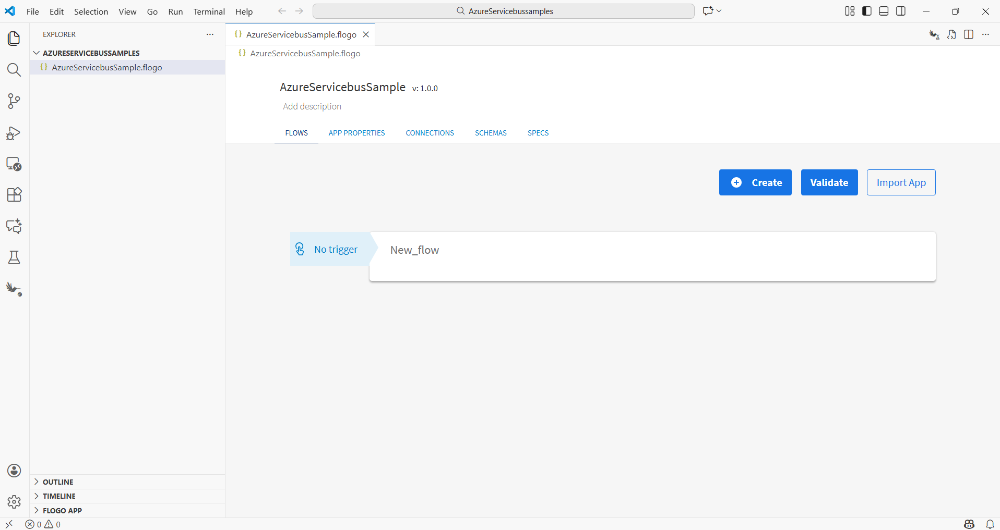

3. On the app details page, select Import app.
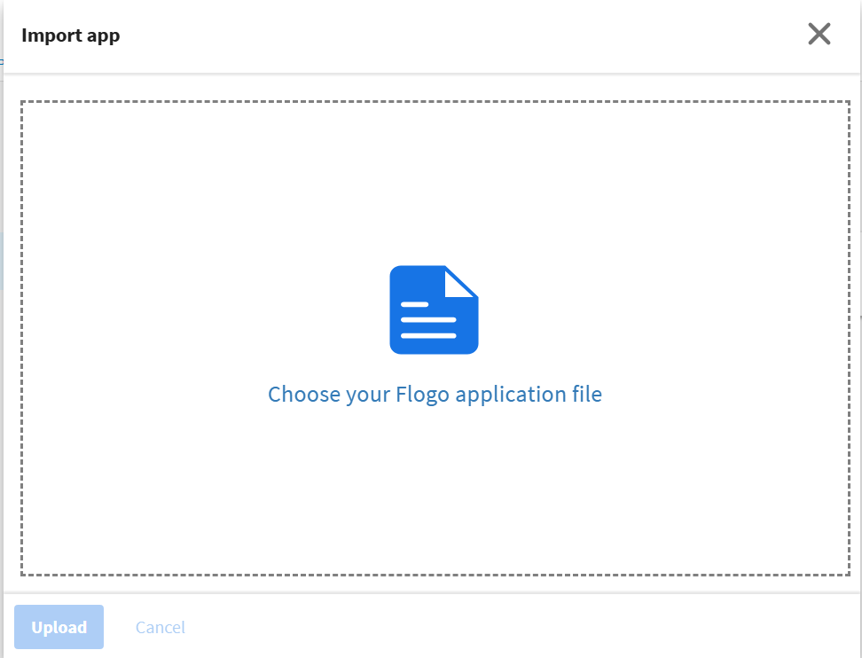

4. Browse on your machine or drag and drop the .json file for the app that you want to import.
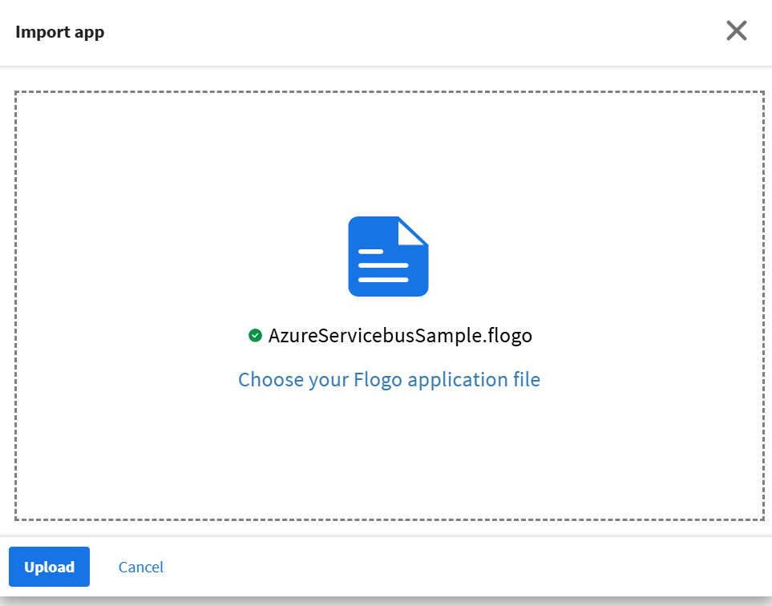

5. Click Upload. The Import app dialog displays some generic errors and warnings as well as any specific errors or warnings pertaining to the app you are importing. It validates whether all the activities and triggers used in the app are available in the Extensions tab.
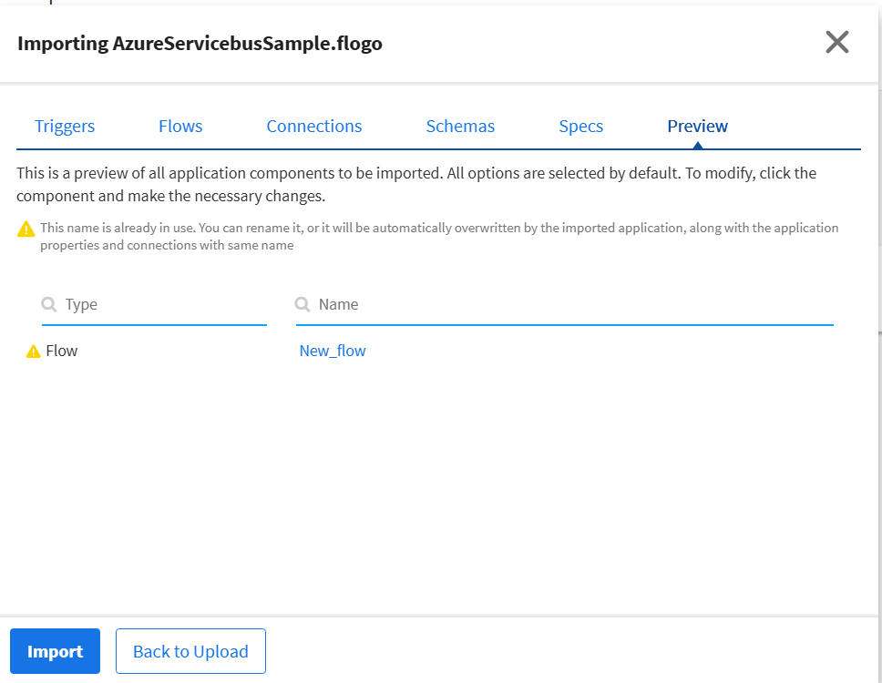

## Understanding the configuration

### The Connection
When you import this app, you need to configure the 'AzureServiceBus' connection in the Connections page. It has pre-filled values for some paramaters. But if you have an app with AzureServiceBus connection having Namespace, AuthorizationRule and SharedAccessKey required to authenticate the broker then after import such apps, SharedAccessKey field will be empty as shown in below screenshot.

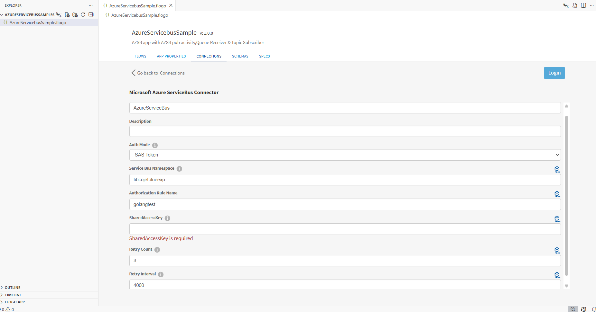

Note: After imported an app, in the imported connection under Connection tab,
* Namespace has prefilled value which is the Name of Azure Service Bus Namespace (get it from Azure Portal ).
* Authorization Rule has prefiled value which is policy (get it from the Azure Portal under Shared Access Policies).
* Shared Access Key has blank value which is Primary or Secondary key under respective policy(get it from Azure Portal under policy which you have selected). 

### The Flow and InvokeRestService activity
If you open the app, you will see there are three flows, one is Publisher for Queues and Topics and other two is like consumer i.e QueueReceiver and TopicSubscriber
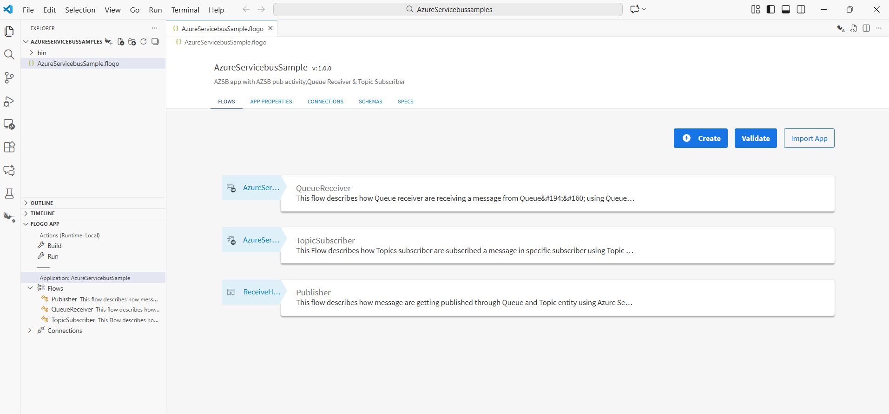

The 'Publisher' flow in the AzureServicebusSample app basically sends a messages over Queues and Topics. It has two publish activites for Queue and Topic respetively.All these operation will be done when execute the REST trigger with valid input schema provided in ReceiveHTTPMessage trigger. REST trigger have method POST.
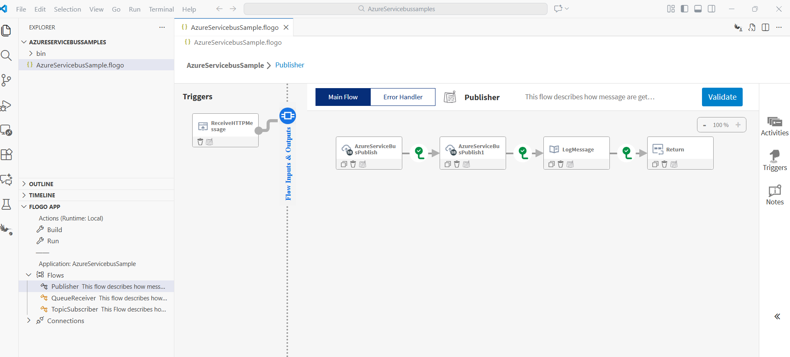

When 'Publisher' flow sends a message through a Queue, then the Queue Receiver trigger receives the message from the respective queue. To see how Will Queue Receivers work, see Azure Service Bus documentation.
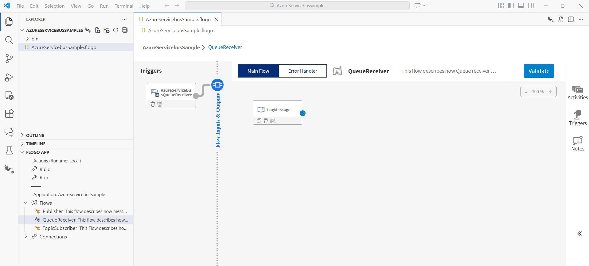

When 'Publisher' flow sends a message through a Topic, then the Topic Subscriber trigger receives the message from the topic of the respective subscriber. To see how Will Queue Receiver works, see Azure Service Bus documentation.
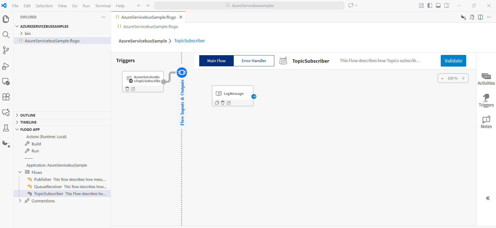

### Run the application
For running the application, 
1. Start by adding a local runtime in Visual Studio Code. Assign a name to the runtime and click the "Save" button.

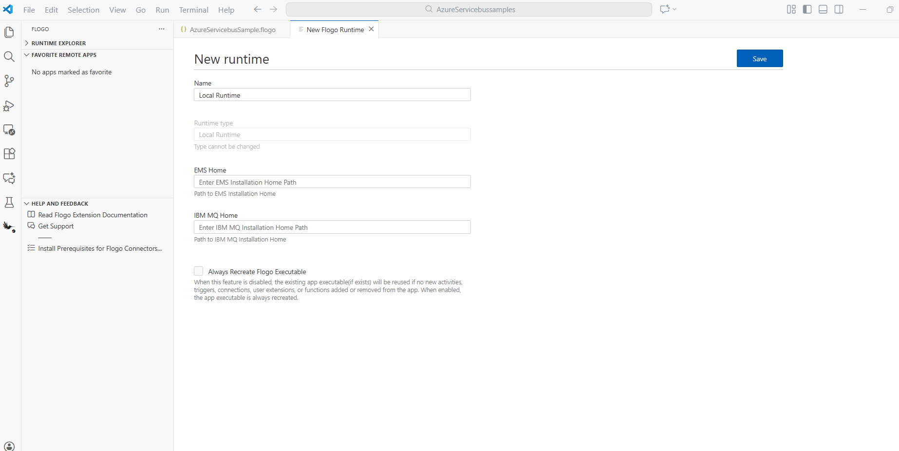

2. Select the local runtime you added for your Flogo Azureservicebus app. To do this, click on the FLOGO APP in the explorer, then click "Actions" and select the added Local Runtime.
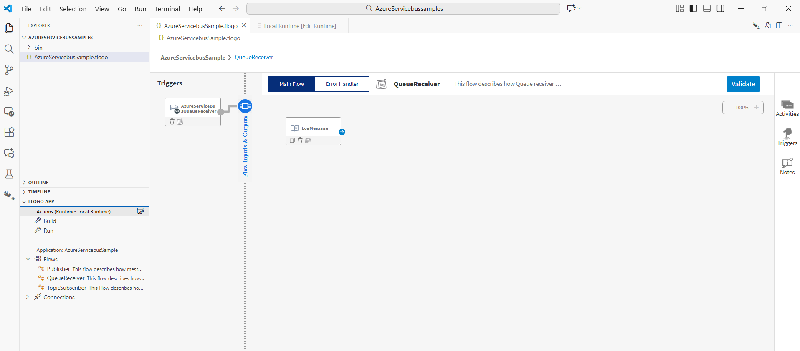

3. Now Build your Flogo Azureservicebus app. In the FLOGO APP section, click on "Build,".
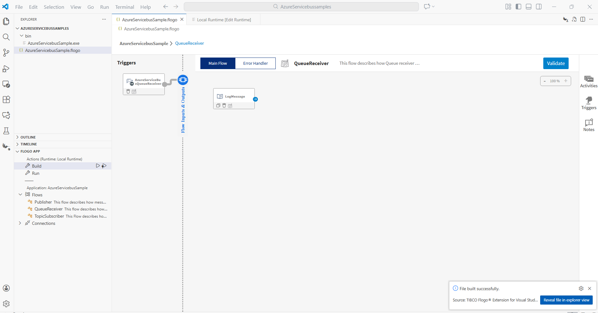

4. Once build is successful you can see the binary in bin folder.

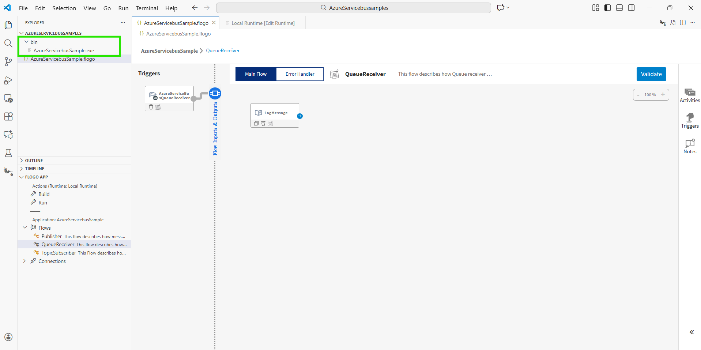

5. Now Run the Azureservicebus app. 
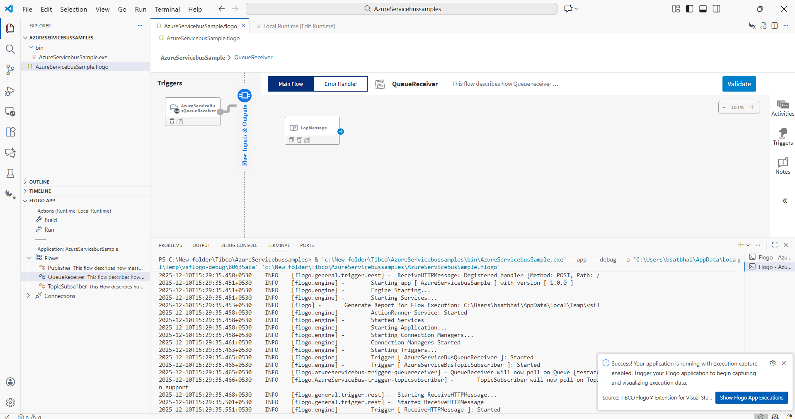.

6.Now Open Postman and select the method as 'POST',pass request body and url then click on 'Send' button.

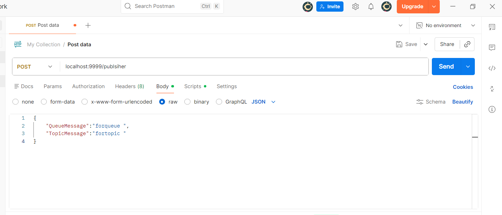.

7.After click on 'Send' button see the results.

## Outputs

1. Sample Response when click on 'Send' button

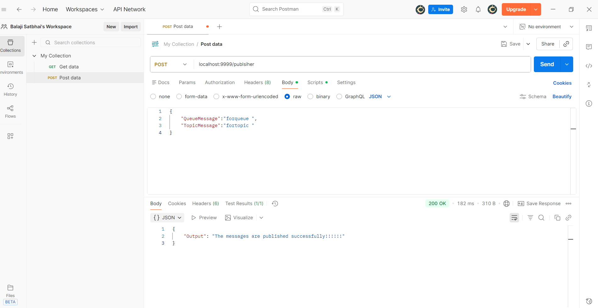

2. Sample Logs in VS Code
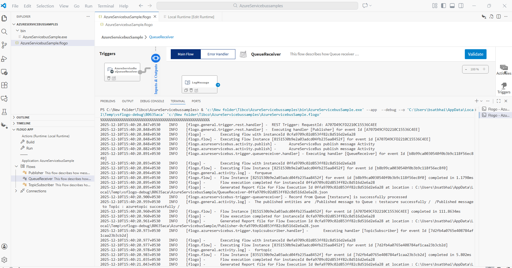

## Troubleshooting

* If you see 401 Unauthorized error or token refresh error, re-configure the connection.

